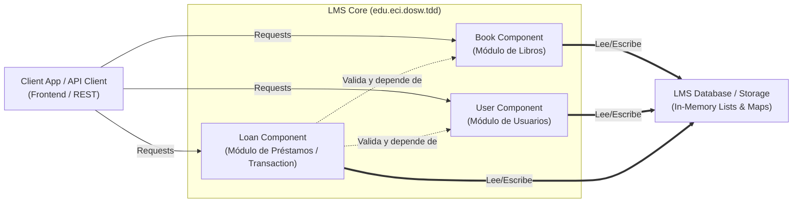

# DOSW Company - Sistema de Gestión de Bibliotecas

Este repositorio contiene la base del sistema de gestión de bibliotecas para **DOSW Company**. El sistema está diseñado para gestionar libros, usuarios y préstamos de forma robusta, asegurando la disponibilidad de los ejemplares y registrando la actividad mediante un patrón de arquitectura en capas y siguiendo metodologías de calidad.

## Requerimientos de Funcionalidad

- **Gestión de Libros:** Agregar libros, listar todos los ejemplares, buscar por código de identificación y actualizar su estado de disponibilidad.
- **Gestión de Usuarios:** Registrar nuevos usuarios, listar los existentes y buscar por identificación.
- **Gestión de Préstamos:** Manejo del listado de usuarios, un listado de préstamos y un Mapa de Libros (relacionando el libro con la cantidad de ejemplares disponibles).

## Arquitectura del Sistema

El proyecto sigue un patrón de arquitectura en capas definido dentro del paquete `edu.eci.dosw.tdd`.

### 1. Diagrama de Componentes (General)

Muestra la vista de alto nivel de las capas principales del sistema y cómo interactúan entre sí.

### 2. Diagrama de Componentes Específico

Ofrece un nivel de detalle más profundo sobre las clases exactas que conforman cada paquete de la aplicación.

```mermaid
flowchart TB
    %% Definición de Controladores
    subgraph Controller_PKG ["controller"]
        direction TB
        subgraph DTO ["dto"]
            BookDTO
            UserDTO
            LoanDTO
        end
        subgraph Mapper ["mapper"]
            BookMapper
            UserMapper
            LoanMapper
        end
        BookController
        UserController
        LoanController
        
        BookController -.-> BookDTO & BookMapper
        UserController -.-> UserDTO & UserMapper
        LoanController -.-> LoanDTO & LoanMapper
    end

    %% Definición del Core
    subgraph Core_PKG ["core"]
        direction TB
        
        subgraph Service ["service"]
            direction LR
            BookService
            UserService
            LoanService
        end

        subgraph Model ["model"]
            direction LR
            Book
            User
            Loan
        end

        subgraph Validator ["validator"]
            direction LR
            BookValidator
            UserValidator
            LoanValidator
        end

        subgraph Util ["util"]
            direction LR
            ValidationUtil
            DateUtil
            IdGeneratorUtil
        end

        subgraph Exception ["exception"]
            direction LR
            BookNotAvailableException
            UserNotFoundException
            LoanLimitExceededException
        end
    end

    %% Relaciones Controller -> Service
    BookController --> BookService
    UserController --> UserService
    LoanController --> LoanService

    %% Relaciones Service -> Model
    BookService --> Book
    UserService --> User
    LoanService --> Loan
    LoanService -.-> Book
    LoanService -.-> User

    %% Relaciones Service -> Validator
    BookService --> BookValidator
    UserService --> UserValidator
    LoanService --> LoanValidator

    %% Relaciones Service/Validator -> Util/Exception
    Validator -.-> ValidationUtil
    LoanService -.-> DateUtil
    Service -.-> IdGeneratorUtil
    
    BookValidator -.-> BookNotAvailableException
    UserValidator -.-> UserNotFoundException
    LoanValidator -.-> LoanLimitExceededException
```

## Implementación y Pruebas (Ciclo de Calidad)

Tras la estructuración mostrada arriba y la implementación de un **Manejador de Errores Global (Global Error Handler)**, se debe seguir el ciclo:

1. **Establecer escenarios de prueba:** Redactar casos de éxito y de fallo/error.
2. **Crear clases de prueba con JUnit:** Aplicar TDD en la construcción del core.
3. **Ejecutar Pruebas y Análisis:** Realizar medición de cobertura (coverage) y análisis estático de código.
