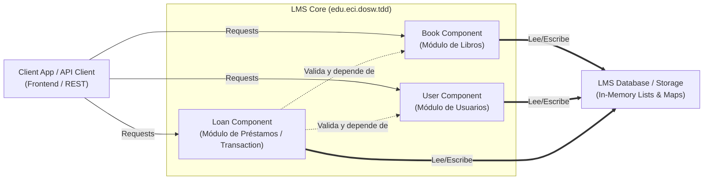
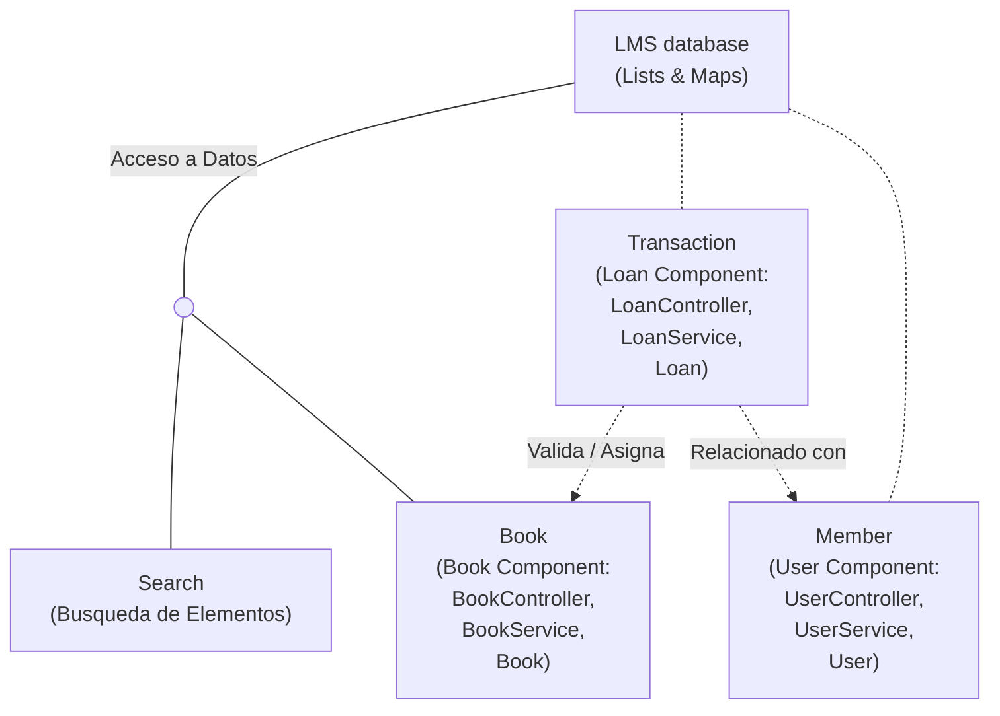

# DOSW Company - Sistema de Gestión de Bibliotecas

### 1. Diagrama de Componentes (General)

Muestra la vista de alto nivel de las capas principales del sistema y cómo interactúan entre sí.

### 2. Diagrama de Componentes Específico

