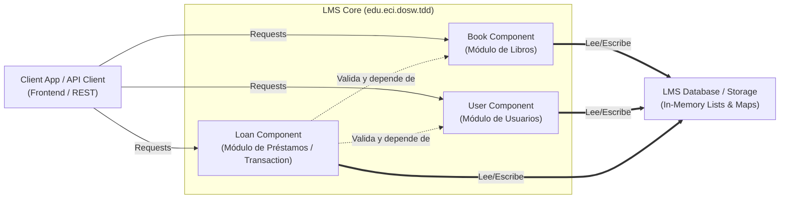
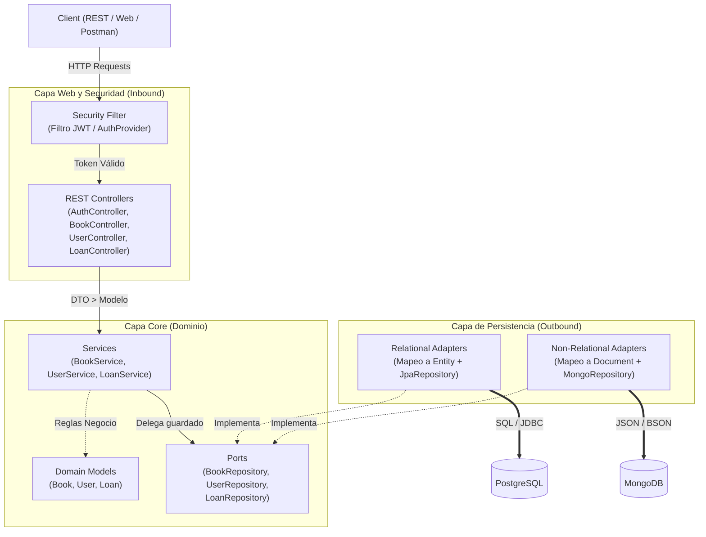

# DOSW Company - Sistema de Gestión de Bibliotecas

### 1. Diagrama de Componentes (General)

Muestra la vista de alto nivel de las capas principales del sistema y cómo interactúan entre sí.



### 2. Diagrama de Arquitectura y Componentes Hexagonal

Muestra el flujo de información desde la petición hasta las dos fuentes de persistencia reales.




## Metamodelo Conceptual

# Que entidades tengo? 
En este caso el sistema tiene un total de 3 entidades principales" 

1. Book
2. User
3. Loan

# Que relaciones tengo? 

Relación	Cardinalidad	Descripción
User → Loans	1:N	Un usuario puede tener muchos préstamos
Loan → Book	N:1	Muchos préstamos pueden ser del mismo libro
Loan → User	N:1	Muchos préstamos pertenecen a un usuario

En otras palabraas, un usuario puede tenermuchos prestamos, y un prestamo solo pertenece a un usuario. 
Tambien tenemos que muchos prestamos pueden ser de un unico libro, y un prestamo solo pertenece a un libro.
Finalmente tenemos que muchos prestanos pueden pertenecer a un musmo usuario, y un prestamo solo pertenece a un usuario, asi como se menciono anteriormente. 

# Es el mismo modelo relacional solo cambiando la BD? 

No, esto debido a que mongoDB nos da la opcion de desnormalizar la informacion, es decir, que podemos guardar la informacion de los prestamos en un solo documento, en lugar de tener que crear tablas separadas para cada una de las entidades, esto debido a que MongoDB es una base de datos NoSQL, que almacena la informacion en documentos JSON. 

# Embebido o referenciado? 

Vamos paso por paso:

    1. Embeber Loans dentro de user? : 
        Un usuario puede tener muchos prestamos, en ese caso la lista podria crecer indefinidamente, por ende no es una buena opcion, debido a que Mongo tiene un limite de 16MB por documento, ademas los prestamos se van a consultar de forma independiente, por lo cual no es bueno dejarlos embebidos dentro de User. 
        Por ello, lo mejor es dejarlo en un documento independiente y referenciar a user por ID.

        un prestamo no puede vivir sin un usuario, por lo cual es una buena opcion dejarlo en un documento independiente y referenciar a user por ID. 

    2. Embeber Book dentro de Loan? : 
        Para este caso, es algo diferente al anterior, ya que, un libro puede pertenecer a muchos prestamos, por lo cual no se embebe el libro dentro del prestamo, sino que se referencia al libro por ID.
        En otras palabras, Loan referencia a Book por Id, pero guarda un snapshot del libro en el momento del prestamo, para que no se pierda la informacion del libro en caso de que se actualice o se elimine.
    
    3. Book tiene sub-Documentos? :
        No, debido a que no tiene relaciones complejas, por lo cual es un libro plano e independiente. 


# Definicion de los documentos MongoDB

### Coleccion `books`
Documento plano, sin sub-documentos embebidos.

```json
{
  "_id": "550e8400-e29b-41d4-a716-446655440000",
  "title": "Clean Architecture",
  "author": "Robert C. Martin",
  "totalCopies": 5,
  "availableCopies": 3
}
```

---

### Coleccion `users`
Documento plano. Los prestamos NO se embeben aqui (crecerian ilimitadamente).

```json
{
  "_id": "661e9511-f30c-52e5-b827-557766551111",
  "name": "Carlos Ruiz",
  "username": "carlos.ruiz",
  "password": "$2a$10$hasheadoBcrypt...",
  "role": "USER"
}
```

---

### Coleccion `loans`
Referencia a `users` y `books` por ID. Embebe un **snapshot** del libro al momento del prestamo para preservar el historial.

```json
{
  "_id": "772fa622-g41d-63f6-c938-668877662222",
  "userId": "661e9511-f30c-52e5-b827-557766551111",
  "bookId": "550e8400-e29b-41d4-a716-446655440000",
  "bookSnapshot": {
    "title": "Clean Architecture",
    "author": "Robert C. Martin"
  },
  "loanDate": "2026-03-27T14:00:00",
  "returnDate": "2026-04-10T14:00:00",
  "status": "ACTIVE"
}
```

> **Nota de diseño:** `bookSnapshot` es embebido porque registra los datos del libro *tal como eran en el momento del prestamo*. Si el libro se actualiza despues, el historial permanece intacto. `userId` y `bookId` son referencias logicas (como foreign keys) para las operaciones de negocio.


## DIAGRAMA DE CLASES

Click derecho sobre la imagen y abrelo en una nueva ventana para abrir el .svg y que puedas visualizar correctamente el diagrama de clases


